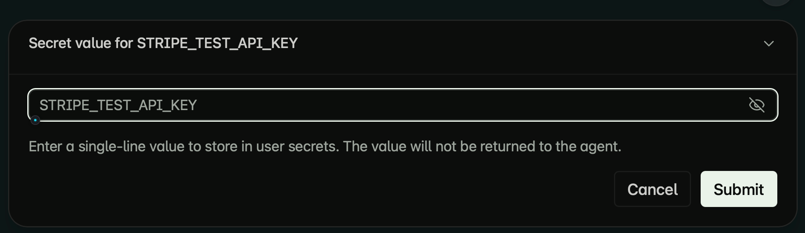

# Amp Collect Secret

An [Amp](https://ampcode.com) plugin that asks you for a secret in an owner-only dialog and stores it with `amp secrets set`.

Agents can request a name and destination without receiving the value in the tool call or result. You review the destination before entering the value. Stored secrets can later be injected into an agent's environment, so only install this plugin in an Amp environment you trust.



*The screenshot is from a live test of an earlier dialog copy. The current dialog also shows the account, workspace, server, and destination. No value is shown.*

## Install

Requires Amp with [plugin support](https://ampcode.com/docs/plugin-api) and the `amp` CLI available to the plugin. This release targets Linux Amp orbs and other POSIX hosts; Windows descendant-process cleanup is not supported.

```bash
amp plugins add https://raw.githubusercontent.com/jkudish/amp-collect-secret/v0.1.0/collect-secret.ts
```

`amp plugins add` installs the plugin at system scope by default. Review [the source](collect-secret.ts) before installing. If you already have a personal plugin registering `collect_secret`, use that installation instead of adding a duplicate.

## Use

Ask Amp: “Store `EXAMPLE_API_KEY` as a user secret.” Amp invokes `collect_secret` with the name and scope. You confirm the destination, then enter the value in an owner-only secret field. A successful call reports `Stored EXAMPLE_API_KEY as an Amp user secret.` without returning the value.

Supported scopes: `user`, `workspace`, `project`, and `app`. Project and app scopes require an explicit `namespace/name` target. Names must start with an uppercase letter or underscore and contain only uppercase letters, digits, and underscores (maximum 128 characters). Values must be nonempty, single-line UTF-8 strings of at most 1 MiB. Multiline private keys are not supported.

The plugin passes the value to `amp secrets set --secret --data-file -` over stdin; it does not put it in command arguments or return CLI output. It shows the connected Amp account and server, but **cannot prove that the CLI's credentials belong to that account**. Check the account and destination when prompted. Existing secrets at that destination can be replaced. A timeout or interrupted command may have completed the write: check the destination before retrying.

The plugin makes no independent network request. The Amp CLI contacts Amp to store the secret. Amp [injects configured secrets into eligible environments](https://ampcode.com/docs/orbs/handling-secrets); those environments and tools running in them may access the value.

## Development

Run `bun test` to exercise validation, cancellation, stdin delivery, output handling, timeout, and unload behavior. See [CONTRIBUTING.md](CONTRIBUTING.md) for setup, [SECURITY.md](SECURITY.md) for private reports, and [CHANGELOG.md](CHANGELOG.md) for released changes.

Inspired by [harrismcc's original collect-secret gist](https://gist.github.com/harrismcc/e91f8444899e7549cfe77c4bf6a2f6e4). This implementation was rewritten around validated destinations, owner-only input, and process cleanup. Thank you for the idea.

MIT licensed. See [LICENSE](LICENSE).
